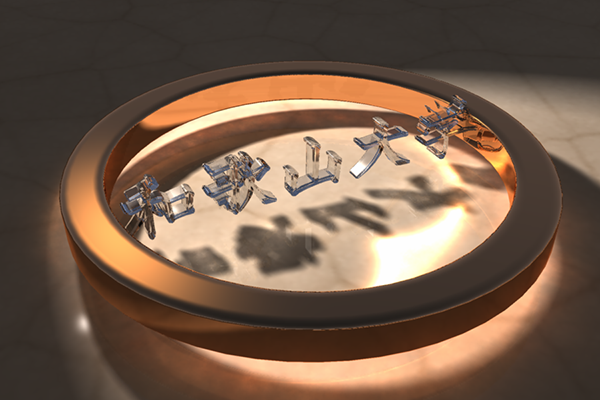
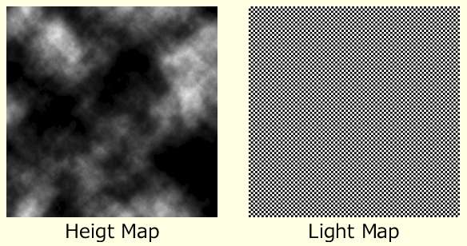

# A Makyoh Simulator Implementation

## Overview

This is a demonstration program developed for a presentation at [Makyoh 2025](https://sites.google.com/view/makyoh-2025). This program focuses on the real-time simulation of Makyoh (magic mirror), aiming to reproduce caustics generated on a receiver surface by the reflection of light from a bumpy plane.

## Introduction

As you know, a Makyoh projects a pattern onto a screen or wall with its reflected light[^1].  This pattern is formed by the subtle bumps on the mirror's surface, which are created by the design carved into its back.  The pattern appears due to the varying density of the reflected light.  In computer graphics, this kind of pattern is called caustic.

Research into reproducing caustics caused by light reflection and refraction has been ongoing in computer graphics since the 1980s.  Today, many CG software packages can render caustics, and research in this field continues to advance.



[^1]:  [極限の薄さ 神宿す　山本合金製作所の「魔鏡」（ここに技あり）](https://www.nikkei.com/article/DGXLASJB01H0N_T00C16A2AA2P00/)

### Reproduction of Makyoh Caustics

Makyoh caustics are created by microscopic bumps on the mirror's surface, reflecting the decorative pattern on its back.  When we try to simulate a Makyoh in computer graphics, we face some challenges.

The caustic patterns are generated by microscopic bumps on the mirror's surface, which are formed by the relief pattern on the back.  However, these bumps are incredibly small.  For example, to create a 1cm striped pattern on a screen 2 meters away, the height variation on the mirror surface is only about plus or minus 2.5 micrometers.  This is extremely small relative to the Makyoh's overall size.

Therefore, directly modeling these microscopic bumps in 3D is challenging due to the precision limits of single-precision floating-point numbers used in 3D graphics hardware.  This lack of precision makes it difficult to accurately represent the geometry and calculate the resulting caustic pattern.

### Controlling Reflection Direction with normal map

Since the bumps on a Makyoh are visually imperceptible, we don't actually need to deform the 3D model's geometry.  Instead, we can focus on controlling the direction of reflected light.  The reflection direction is governed by the surface normal vector at any given point.

To manipulate this, we employ a common computer graphics technique called Bump Mapping.  This method uses a special texture, called a Normal Map, to alter the normals of the mirror's surface.  We generate this normal map from a height map representing the backside pattern.

This approach allows us to effectively manage the floating-point precision issues by scaling the normal vectors after they are calculated.

### Proposed Method

Our proposed method follows these steps:

First, we generate a normal map from a height map of the backside pattern, applying scaling to ensure accuracy.

Then, during rendering, for each point on the receiving surface visible through a display pixel, we calculate the reflected light direction from the Makyoh using the normal map.

If this reflected path leads to a light source, we use that light's radiance to shade the point on the receiver object.   By repeating this process across the entire display image, we can reconstruct the concentrated light pattern—the caustic image of the Makyoh.

## Modeling the Reflection of Makyoh

First, let me briefly explain a fundamental concept from computer graphics.  The energy per unit area of light that hits a surface is called irradiance, and its unit is watts per square meter (W/m<sup>2</sup>).

For a point ${\bf p}$ on the receiver with a normal vector ${\bf n}$, if light in direction ${\bf l}$ is incident on it:

- The radiance of a light source in direction ${\bf l}$ is defined as $L_i\left({\bf l}\right)$.
- The infinitesimal solid angle of that light source is $d\omega_i$.
- The incident angle is denoted as $\theta_i$.

The irradiance $dE$ at a point ${\bf p}$ is expressed as:

$$dE=L_i\left({\bf l}\right)\cos\theta_i d\omega_i$$

This is the well-known Lambert's cosine law.


### Irradiance from Hemispherical Light Source

Therefore, the irradiance $E$ at point ${\bf p}$ from all incoming light across the entire hemisphere ${\Omega}$ is the total sum divided by $\pi$.

$$E=\frac{1}{\pi}\int_\Omega L_i\left({\bf l}\right)\cos\theta_i d\omega_i$$

This is the sum of the irradiance from infinitesimal solid angles $d\omega_i$ over the entire hemisphere $\Omega$, divided by the projected area of the hemisphere on the receiver surface, which is expressed as:

$$\int_\Omega \cos\theta_i d\omega_i = \pi$$


### Radiance

In contrast to irradiance, which is the total light energy arriving at a surface, radiance describes the energy traveling in a specific direction from a single point in a specific observation direction ${\bf v}$.  Its unit is watts per steradian per square meter (W/sr/m<sup>2</sup>).

The radiance $L_o\left({\bf v}\right)$​ observed from a viewing direction ${\bf v}$ is calculated by integrating the incoming light $L_i\left({\bf l}\right)$​ from all directions over the hemisphere $\Omega$.  This is weighted by the cosine of the incident angle and a term called the Bidirectional Reflectance Distribution Function, or BRDF, denoted as $f\left({\bf l},{\bf v}\right)$:

$$L_o\left({\bf v}\right)=\frac{1}{\pi}\int_\Omega f\left({\bf l},{\bf v}\right)L_i\left({\bf l}\right)\cos\theta_i d\omega_i$$

The BRDF $f\left({\bf l},{\bf v}\right)$ essentially describes how a surface reflects light, defining the ratio of incoming light from direction ${\bf l}$ to outgoing light in direction ${\bf v}$.

### Radiance of Perfectly Diffuse Surface

However, for perfectly diffuse surface, the BRDF can be treated as a constant.  If we call this constant $c_{diff}$​, then the radiance, $L_o$​, is simply the irradiance of the surface multiplied by $c_{diff}$.

$$L_o=\frac{c_{diff}}{\pi}\int_\Omega L_i\left({\bf l}\right)\cos\theta_i d\omega_i=c_{diff}E$$

In other words, cdiff represents the color of the surface.

Now, if the only light source in the sky is the Makyoh, we only need to calculate the irradiance from the region of the solid angle, $\omega$, that the Makyoh occupies as seen from the receiver surface.  We'll call this specific irradiance $E_\omega$​.

$$L_o=\frac{c_{diff}}{\pi}\int_\omega L_i\left({\bf l}\right)\cos\theta_i d\omega_i=c_{diff}E_\omega$$


## Algorithm

When reproducing caustics in general CG software, a common method is to trace light from the light source.  For example, in Photon Mapping, photons are emitted from the light source, and their reflection and refraction paths are tracked until they land on the receiver surface.  The amount of photons that accumulate at a point determines its irradiance, $E_\omega$​.

While this is a versatile method that can be applied to any scene, accurately calculating the irradiance for a projected image from a Makyoh requires an increased number of emitted photons, which significantly raises the computational cost.

Therefore, our proposed method focuses on sampling points directly on the Makyoh's surface and aggregating the reflected light to determine the irradiance on the receiver surface.  This approach is specific to the projected image of a Makyoh, but by concentrating the sample points on the Makyoh's surface, we can efficiently improve the accuracy of the result.

### Radiance from a Light Source with a Finite Area

The radiance at a point ${\bf p}'$ on the Makyoh's surface is the radiance of a point ${\bf p}''$ on the light source surface multiplied by the reflectance of the Makyoh, $\kappa_m$​.

This point ${\bf p}''$ is located in the reflection direction, ${\bf l}′={\bf l}-2\left({\bf l}\cdot{\bf n}'\right){\bf n}'$, of the incident light vector, ${\bf l}$, that originates from a point ${\bf p}$ on the receiver surface.

Therefore, we find the intersection point ${\bf p}''\left(t\right)={\bf l}'t+ {\bf p}'$ between the light source surface and the ray that passes through the point ${\bf p}'$ on the Makyoh and extends in the direction ${\bf l}'$.  We then determine the radiance, $L_s\left({\bf p}''\right)$, at that point.

$$E_\omega=\frac{\kappa_m}{\pi}\int_\omega L_s\left({\bf p}''\right)\cos\theta_i d\omega_i$$

Since the light source is self-luminous, we can assume its radiance is constant regardless of direction.  If the ray does not hit the light source, the radiance is set to zero or we use the radiance of the background light.


### Radiance from a Parallel Light Source

When the light source is composed of parallel rays, it is considered to be at an infinite distance and has no size.  In this case, the radiance of the light source is determined based on the dot product of the reflection direction, ${\bf l}′$, and the light ray direction, ${\bf l}_s$​.  The coefficient $m$ represents a finer, more granular roughness on the Makyoh's surface, and we should keep its value large.


## Experiment

Using the experimental program we've developed, we can display the appearance of the Makyoh as seen from the receiver surface.  The irradiance of the receiver surface will be determined by summing up the radiance from this appearance.

### Reflection by Grooved-Shape Height Map (128x128 Pixels)

First, we will show the appearance of the Makyoh as seen from the receiver surface, using a grooved-shape height map.  The light source is placed coaxially with the viewpoint.  Although this setup is not realistic, we used it to make the reflection easier to observe.

In this height map, the highest points are outside the grooves, and the lowest points are in the center of the grooves.  Therefore, when the height scale is positive, the grooves are concave, and when it is negative, they are convex.  In the case of concave grooves, the reflections within those grooves are horizontally inverted.


https://github.com/user-attachments/assets/673b25b3-e812-4253-b30c-09bfabd1f1c6

### Reflection by Terrain-Like Height Map (128x128 Pixels)

This is the result when we use a terrain-like height map.


https://github.com/user-attachments/assets/57545d11-579c-419b-a3e4-04cdf3c4a9e8

### Reflection of a Grid by Grooved-Shape Height Map (128x128 Pixels)

This is the result when we use a grooved-shape height map with a finely-gridded light source map.  The light source map is 512 pixels in size, and since it is scaled down in the final rendered image, aliasing occurs.


https://github.com/user-attachments/assets/6cc4cc50-a1d2-470f-92ed-faae259bc747

### Reflection of a Grid by a Terrain-Like Height Map (128x128 Pixels)

This is the result when we use a terrain-like height map with a finely-gridded light source map.  In this case as well, a rough, aliasing-like texture appears as the Makyoh moves.



https://github.com/user-attachments/assets/24d50470-9a7f-4312-a356-dfbae8197f97

### High-Resolution Grooved-Shape Height Map (512x512 Pixels)

When we increase the resolution of the grooved-shape height map, aliasing from the sampling of the height map affects the reflection.

If the height map has a low resolution, the height changes appear continuous due to the bilinear interpolation performed during texture sampling.  However, when the height map's resolution is higher than its display resolution, bilinear interpolation is not performed during the sampling process, which can lead to discontinuities in the height map's changes.  This is also a cause of aliasing.

This effect becomes particularly noticeable when the original height changes are smooth, as is the case with this grooved-shape height map.


https://github.com/user-attachments/assets/c107b1e4-90d2-4105-8415-0f2f11f03c5f

### High-Resolution Terrain-Like Height Map (512x512 Pixels)

On the other hand, when we increase the resolution of a terrain-like height map—which originally has complex height variations—the shading of the terrain becomes correspondingly sharper.  However, the aliasing that appears in the reflection is still perceptible.


https://github.com/user-attachments/assets/2c4041c8-b7dd-42f1-8b72-111eeedef43f

## Conclusion

### Summary

In this study, we first modeled the formation of the pattern in the projected image from a Makyoh's reflected light.  Based on this model, we developed a simulator.  This simulator can use any image data for the height map and the light source map.  Furthermore, it can use geometric shape data in the Wavefront OBJ format for the receiver surface.

To make the geometric shape of the bumps on the mirror surface easier to perceive, we can place a single point light source in addition to the light source map.  The pose of the Makyoh, the light source, and the receiver surface can all be specified.  It is also possible to specify the position and intensity of the point light source.

Using these features, the simulator can reproduce the reflection of a Makyoh and its projected image.  In this presentation, we reported on our experiments to reproduce the reflections of a Makyoh using this simulator.

### Future Work

However, this research is not yet complete, and there are several areas for future work.

First and most importantly, we need to conduct experiments to reproduce the final projected image of the Makyoh, not just the reflection on its surface.  This will require preparing a more suitable height map and finding the optimal setup.

Second, our experiments revealed that the method is prone to aliasing when using high-resolution textures.  We plan to address this by implementing mipmapping.

Finally, we want to improve our normal map generation and explore using dynamic height maps from a depth sensor, which could allow us to create moving caustic projections in real time.


## Build Instructions

This project, although it is still working in progress, includes build files for multiple platforms. Please choose the appropriate method for your environment.

### Windows

Use the provided solution file (`makyoh.sln`) with Visual Studio 2022.

### macOS

Open the project using the provided Xcode project file (`makyoh.xcodeproj`).

### Ubuntu Linux

A `Makefile` is provided. Navigate to the project directory in your terminal and run the make command:

```bash
make
```

### CMake (Experimental)

A `CMakeLists.txt` file is also included as an experimental option. However, it has not been fully tested and may not build correctly.

```bash
mkdir build
cd build
cmake ..
make
```
